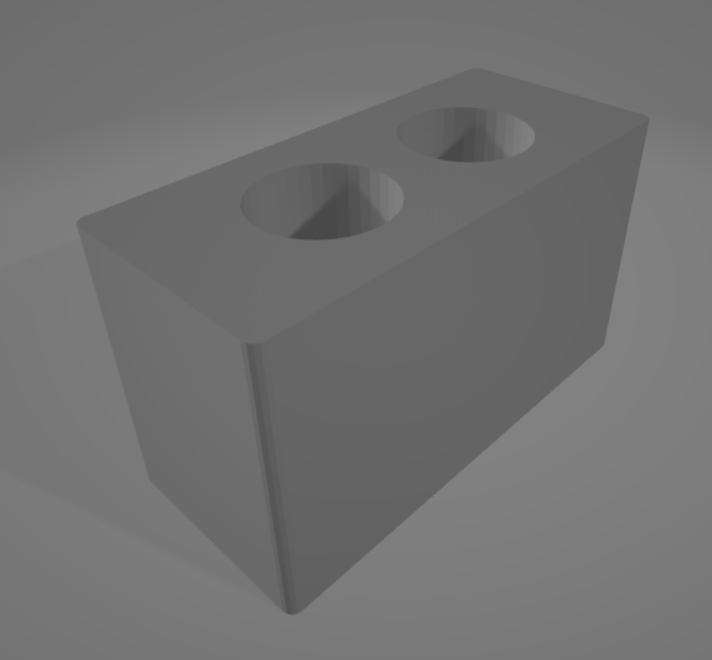

Models
====

This directory contains all the models used for our robot. Since our robot is made out of LEGO technic pieces, we are going to be 3d printing mounts and adapters for the electronics. Below is a table of our 3d printed parts and what they are used for.

| File Name | Description | Image |
| ----------- | ----------- | ----------- |
| Battery Mount.stl | In order to mount the battery onto our robot, we designed and printed a mount which will be connected onto LEGO and can push the battery into |  |
| Servo Adapter.stl | Since we are controlling the steering mechanism with a servo motor, we need an adapter which will fits onto the servo gear and connects to the axles on the steering mechanism |  |
| Servo Mount.stl | To attach our servo motor for steering onto our chassis, we printed a mount which connects to the lego and can mount the servo | |
| Motor Adapter.stl | To transfer the power of the motor to the LEGO axles powering the wheels, we printed an adapter which you put onto the motor shaft and the axle |  |
| Motor Mount.stl | In order to attach the motors onto the LEGO chassis, we are required to 3d print a mount to place the motors |  |
